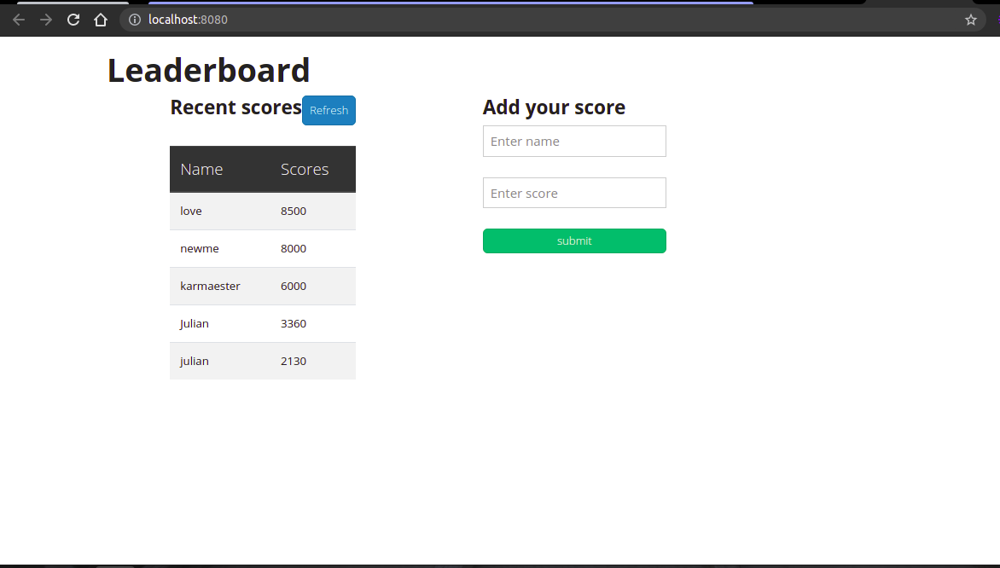

# LeaderBoard


## Learning objective
- Use callbacks and promises.
- Learn how to use proper ES6 syntax.
- Use ES6 modules to write modular JavaScript.
- Use webpack to bundle JavaScript.
- Send and receive data from an API.
- Use API documentation.
- Understand and use JSON.
- Make JavaScript code asynchronous.


### Project requirements
- Use Gitflow in managing the project branch.
- Create an npm project with webpack.
- Use ES6 modules, with import and export
- Read the [Leaderboard API documentation](https://www.notion.so/Leaderboard-API-service-24c0c3c116974ac49488d4eb0267ade3) to learn how to use this API.
- Create a new game with the name of your choice by using the API.
- Implement the "Refresh" button (receiving data from the API and parsing the JSON).
- Implement the form "Submit" button (sending data to the API).
- Use async and await JavaScript features to consume the API.
- You can use plain CSS or any CSS framework.
  
========

## Built With 

- HTML/CSS
- JavaSCcript
- Node.JS
- Bootstrap

========

[Live Link](https://collinstatang.github.io/LeaderBoard/dist/)
## Getting Started

If you want a copy of this file go to the github repository and download it from there

- [`https://github.com/CollinsTatang/LeaderBoard.git`](https://github.com/CollinsTatang/LeaderBoard.git)


#### Setup

```cmd
git clone  https://github.com/CollinsTatang/LeaderBoard.git
cd ./LeaderBoard
```
### Install

```cmd
npm install
```

```cmd
npm run build 
```
### Usage

```cmd
npm start
```


If you are non a technical person you can download the zip file.

- To do that you have to go to the green button that says 'Code' and then press on it.
- Choose the option 'Download Zip' and wait until it download.
- Then you need to decompress it.
- You will need to have Zip compress file software installed in your computer. If you don't have it you can download it from here
  [`https://www.7-zip.org/download.html`](https://www.7-zip.org/download.html)
- Do double click on the Capstone-1.zip and choose a folder where to place all teh decompressed files.
- Once you are done decompressing, you can open the created folder.
- In it you can double click on the index.html file and choose a browser to open it (For example google Chrome Browser).
- Now you should be able to see the project.
- Remember to use the mouse to navigate through the website. Also you can use the keys 'arrow up' and 'arrow down' of your keyboard
  to scroll up and down.

### Prerequisites

- Node.JS

=======

## Author

👤 **Makungong Collins Tatang**

- GitHub: [@CollinsTatang1](https://github.com/CollinsTatang)
- Twitter: [@CollinsTatang1](https://twitter.com/CollinsTatang1)
- LinkedIn: [Makungong Collins](https://www.linkedin.com/in/makungong-collins/)

=======

## 🤝 Contributing

Contributions, issues, and feature requests are welcome!

Feel free to check the [issues page](../../issues/).

=======

## Show your support

Give a ⭐️ if you like this project!

=======

## Acknowledgments

- Microverse for giving me this chance
- The amazing code reviewers for making me improve every day :thumbsup:

=======